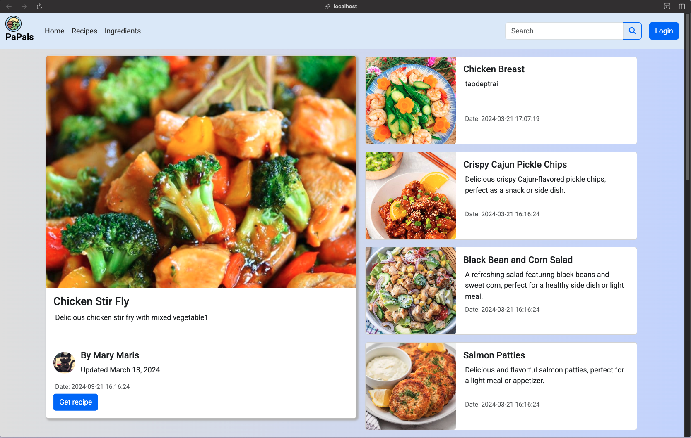
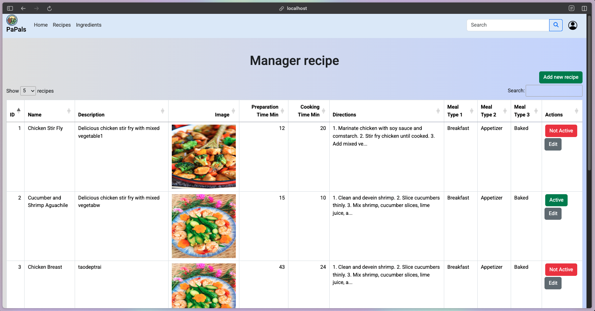
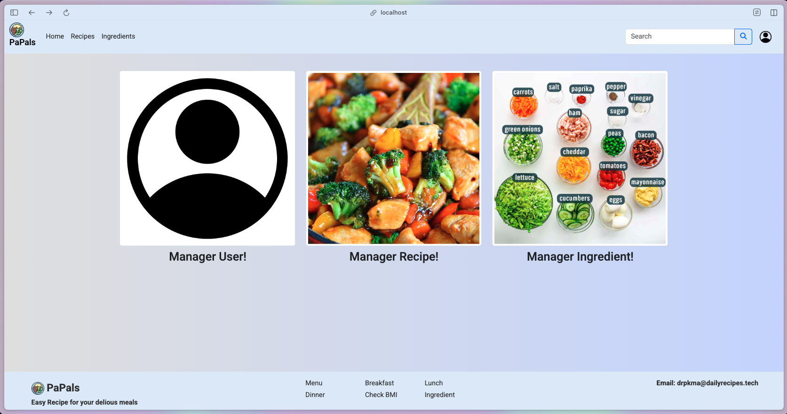

# Daily Recipes Provider (DRP) - Web Application



## 🌟 Project Overview

Daily Recipes Provider (DRP) is a simple but useful web application for discovering and sharing recipes.
It allows users to:

- Browse and search for recipes with full ingredient lists.
- See nutrition info and calories for each dish.
- Share their own recipes with others in the community.

The app is designed with a clean MVC architecture in PHP and MySQL, making it easy to manage users, recipes, and ingredients. It also includes an admin dashboard for managing content and user accounts.

### Project Structure
```
DRP-Website/
├── Web/
│   ├── App/
│   │   ├── Controllers/     # Application controllers
│   │   ├── Models/          # Data models and business logic
│   │   ├── Views/           # User interface templates
│   │   └── Core/            # Core framework components
│   ├── Public/              # Static assets (CSS, JS, images)
│   └── Config/              # Configuration files
├── Data/                    # Database initialization scripts
└── zdocker/                 # Docker configuration
```

## 🚀 Technology Stack

### Backend Technologies
- **PHP 8.2**: Core server-side programming language
- **MySQL 8.3**: Relational database management system
- **Redis 7.2**: In-memory caching for improved performance


### Frontend Technologies
- **HTML5 & CSS3**: Modern web standards for structure and styling
- **JavaScript (ES6+)**: Client-side interactivity and AJAX functionality
- **jQuery**: DOM manipulation and event handling

### Development & Deployment
- **Docker & Docker Compose**: Containerization for consistent development environment
- **Composer**: PHP dependency management with PSR-4 autoloading
- **Apache HTTP Server**: Web server with mod_rewrite enabled

## ✨ Key Features

### Core Functionality

- **User Management**: Complete user registration, authentication, and profile management
- **Recipe Management**: CRUD operations for recipes with image upload capabilities
- **Ingredient Database**: Comprehensive ingredient management with nutritional information
- **Search Functionality**: Powerful search capabilities for finding recipes by name and filtering by categories

### Administrative Features

- **Admin Dashboard**: Complete administrative interface for system management
- **Content Moderation**: Create, update, delete, and moderate user-generated content
- **User Administration**: Activate/deactivate user accounts and manage permissions


### Technical Features
- **Security**: Input validation, SQL injection prevention, and secure file uploads
- **Performance**: Redis caching implementation for optimized database queries
- **Pagination**: Efficient data browsing with paginated results
- **Error Handling**: Comprehensive error logging and user-friendly error pages
- **Search System**: Intuitive search interface with real-time filtering and category-based browsing

## 🛠️ Installation & Setup

### Prerequisites
- Docker Desktop installed on your device


1. **Clone the repository**
   ```bash
   git clone <repository-url>
   cd DRP-Website
   ```

2. **Start the application**
   ```bash
   docker compose up -d
   ```

3. **Access the application**
   - Main application: `http://localhost:8000`
   - phpMyAdmin: `http://localhost:8080` 
   - Database: `localhost:3306` 
   - Redis: `localhost:6379` 

## 👥 Development Team

- **Mạch Tiến Duy** - [GitHub](https://github.com/john-naeder)
- **Trần Quang Diệu** - [GitHub](https://github.com/KyoTranKMA)
- **Lê Thanh Yên** - [GitHub](https://github.com/YenLethanh129)

---
*This project was built as part of our university coursework, focusing on applying modern web development practices in a real-world style application.*